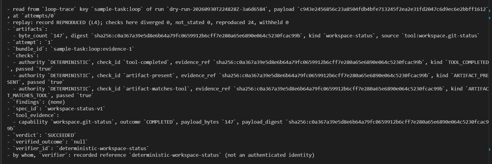
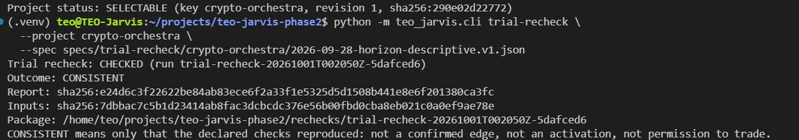
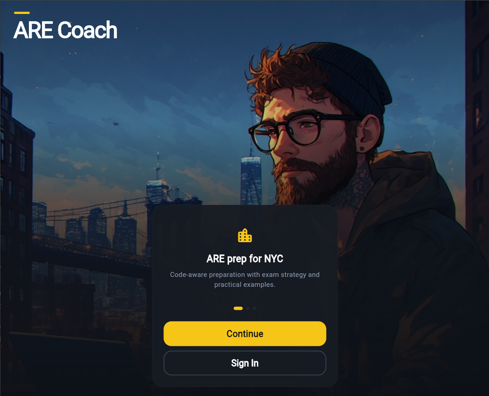
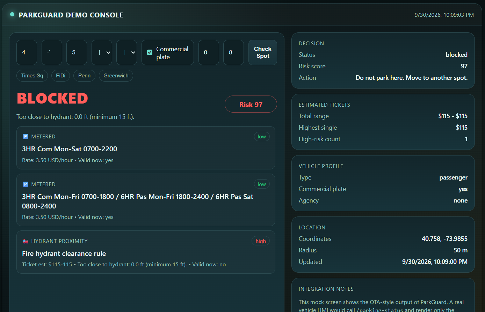

# Vitaliy Tei

### Backend & AI Engineer

I build backend, AI, and data systems with an emphasis on testable behavior, explicit safety boundaries, reproducible evidence, and useful product interfaces.

[LinkedIn](https://www.linkedin.com/in/vitaliy-tei-8562172b1) · [Email](mailto:tei_tech@outlook.com) · Brooklyn, New York

## Featured engineering work

### TEO Jarvis — policy-controlled multi-agent AI orchestration platform
**Python · AI agents · LLM orchestration · Linux isolation · deterministic workflows** &nbsp;|&nbsp; **Private repository; active development**

Building a local-first runtime for coordinating AI-assisted workflows across real software projects. Jarvis combines bounded authority, human approval gates, isolated provider calls, managed Git worktrees, durable execution facts, replay/evaluation, and auditable cross-provider review.

- Deterministic checks verify outcomes instead of trusting agent self-reports.
- Provider execution is constrained by explicit policy and OS-level isolation boundaries.
- Operational domains can be onboarded as controlled projects; Crypto Orchestra is the first active integration.

  

  

### [Crypto Orchestra](https://github.com/Vito-bc/crypto-orchestra) — multi-agent crypto research & paper-trading system
**Python · Multi-Agent Systems · Data Engineering · Backtesting · Reproducible Research** &nbsp;|&nbsp; **Public repository; monitor mode**

Built a seven-specialist-agent research pipeline with signal aggregation, a deterministic risk gate, walk-forward and feasibility analysis, and paper/shadow execution. The research program tested whether directional strategies could clear execution costs and a credible evidence threshold.

- Built explicit trial records and a verification harness that regenerates committed research results from pinned inputs and dependencies.
- The evaluated directional approaches did **not** demonstrate an actionable edge, so the system remains in monitor mode rather than claiming a profitable strategy.
- The system is designed to keep AI-generated proposals behind deterministic risk controls and reproducible evidence checks.

### ARE Coach — AI-powered Architect Registration Exam prep app
**Flutter · Dart · Firebase · AI Applications · Cross-Platform Development** &nbsp;|&nbsp; **Private repository; preparing for release**

Built a cross-platform study product with quizzes, flashcards, study planning, progress tracking, and AI-assisted learning workflows. I designed the application architecture, Firebase authentication/data layer, content workflow, evaluation pipeline, and release infrastructure across iOS, Android, and Web.

  

The source code and question bank remain private while the product approaches release.

### [ParkGuard API](https://github.com/Vito-bc/parkguard-api) — real-time parking intelligence
**Python · FastAPI · REST APIs · NYC Open Data · Backend Engineering** &nbsp;|&nbsp; **Public repository; portfolio MVP**

Built a FastAPI service that combines curb rules, vehicle profiles, hydrant proximity, recurring time windows, and NYC Open Data to return explainable `safe`, `caution`, or `blocked` parking decisions with ticket-exposure estimates.

  

The API includes typed schemas, upstream-data caching, health monitoring, interactive API documentation, and unit/integration tests.

### [CUNY MASS Lab](https://cunymasslab.github.io/people/) — vulnerability detection research & developer tooling
**Python · scikit-learn · Reproducible Environments · Remote Debugging** &nbsp;|&nbsp; **2025 capstone research**

For my CISC 4900 capstone, I worked with Professor Hui Chen's research group at Brooklyn College on machine-learning approaches to software vulnerability detection.

- Built and evaluated a Python ML pipeline covering preprocessing, feature engineering, model training, and baseline comparison.
- Documented reproducible Python research environments and remote debugging workflows for new contributors.
- Coauthored two guides published by the lab with Josemar Ochoa:
  - [Python development environment for lab research](https://cunymasslab.github.io/blog/2025/python-environment-setup/)
  - [Remote debugging with VS Code and DebugPy](https://cunymasslab.github.io/blog/2025/remote-debugging-vscode/)

## Engineering stack

| Area | Stack and methods |
| --- | --- |
| Backend | Python, FastAPI, REST APIs, Firebase Cloud Functions, Firestore |
| AI systems | Agent orchestration, OpenAI API, Anthropic API, RAG, LLM evaluation |
| Data and ML | Pandas, NumPy, scikit-learn, SQL, ETL, backtesting, walk-forward evaluation |
| Product | Flutter, Dart, Firebase, JavaScript |
| Engineering | Git, GitHub Actions, Linux, automated testing, Java, C++ |

## Education

**B.S. Computer Science — Brooklyn College, CUNY**  
Dean's List (Fall 2025). Coursework includes machine learning, databases, operating systems, and data structures.

## Let's connect

I am interested in backend, data, and AI engineering roles where reliability and measured outcomes matter. Reach me by [email](mailto:tei_tech@outlook.com) or [LinkedIn](https://www.linkedin.com/in/vitaliy-tei-8562172b1).
